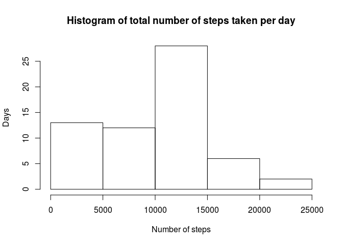
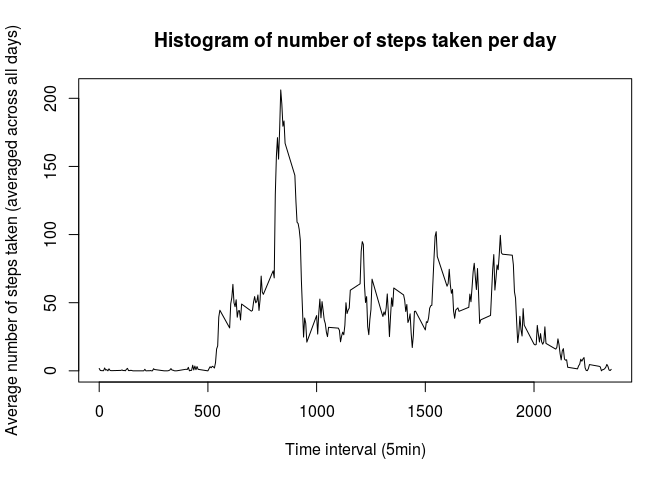
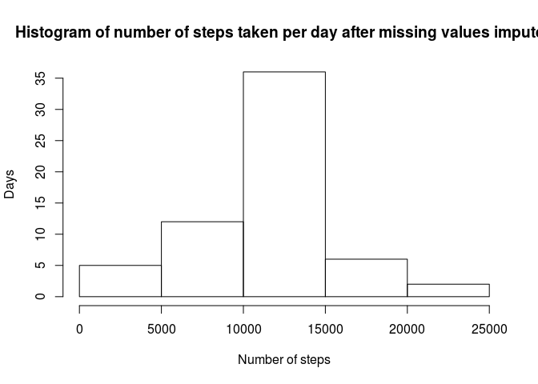
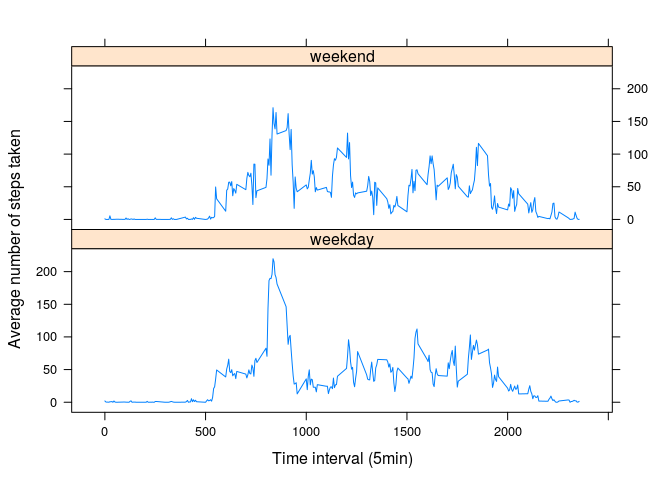

# Reproducible Research: Peer Assessment 1


```r
library(knitr)
library(timeDate)
library(lattice)
```

# Assignment 1 - reproducible research


## Loading and processing the data


```r
data=read.csv("../data/activity.csv")
```

## What is mean total number of steps taken per day?


```r
y=tapply(data$steps,INDEX = data$date,FUN = sum,na.rm=TRUE)
hist(y,xlab="Number of steps",ylab="Days",main="Histogram of total number of steps taken per day")
```

 

```r
mean(y,na.rm=TRUE)
```

```
## [1] 9354.23
```

```r
median(y,na.rm=TRUE)
```

```
## [1] 10395
```

## What is the average daily activity pattern?


```r
mean_steps_per_interval=tapply(data$steps,INDEX = data$interval,FUN = mean,na.rm=TRUE)
df=data.frame(interval=as.numeric(names(mean_steps_per_interval)),steps=mean_steps_per_interval)
plot(df,type='l',xlab="Time interval (5min)",ylab="Average number of steps taken (averaged across all days)",main="Histogram of number of steps taken per day")
```

 

```r
print(paste("5 minute interval with maximum number of steps =",df[ df$steps==max(df$steps),]$interval))
```

```
## [1] "5 minute interval with maximum number of steps = 835"
```

## Imputing missing values
Strategy for imputing missing data: Use the mean of the 5-minute interval across the dataset to fill in NA values into a new dataset


```r
print(paste("Number of missing values=",sum(is.na(data$steps))))
```

```
## [1] "Number of missing values= 2304"
```

```r
datafilled=data
for (i in seq_along(data$date)) {
    if (is.na(data$steps[[i]])) { 
      datafilled$steps[[i]]<-mean( data[ data$interval==data$interval[[i]], ]$steps,na.rm=TRUE) }
}

yfill=tapply(datafilled$steps,INDEX = datafilled$date,FUN = sum)
hist(yfill,xlab="Number of steps",ylab="Days",main="Histogram of number of steps taken per day after missing values imputed")
```

 

```r
mean(yfill)
```

```
## [1] 10766.19
```

```r
median(yfill)
```

```
## [1] 10766.19
```
The mean has adjusted upwards.
The median has changed as well, and happens to be the same as the mean. Since days with NA steps measurement were filled in with mean interval values, this value might be less useful.

## Are there differences in activity patterns between weekdays and weekends?

We first get the means of number of steps by weekday and weekend. Plot two graphs for comparison as shown from sample.


```r
datafilled$isweekday=isWeekday( as.POSIXct( datafilled$date ) )
datafilled$isweekday= gsub(pattern = FALSE, replacement = "weekend",datafilled$isweekday)
datafilled$isweekday= gsub(pattern = TRUE, replacement = "weekday",datafilled$isweekday)

plotdata=aggregate(x = datafilled["steps"],by=datafilled[,c("interval","isweekday")],FUN=mean)

xyplot(steps~interval|isweekday,data = plotdata,type='l',layout=c(1,2),xlab="Time interval (5min)",ylab="Average number of steps taken")
```

 

